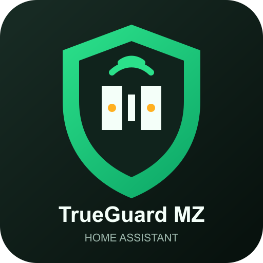

# TrueGuard MZ for Home Assistant

  

  

A local Home Assistant integration for older TrueGuard MZ, SecPro Sikring,
and compatible Climax alarm panels with the built-in `WebPanel` interface.

## Features

- Automatic DHCP discovery for compatible Climax panels.
- Active local-network discovery using the `WebPanel` HTTP fingerprint.
- Manual hostname or IP setup as a fallback.
- Automatic IP updates when a DHCP-discovered panel changes address.
- User-selectable polling interval from 5 to 3600 seconds.
- Alarm control with disarm, full arm (away), and partial arm (home).
- Door and window contacts, smoke, motion, and moisture sensors.
- On/off modules and diagnostic signal sensors.
- Local communication only; no cloud account is required.
- UI setup, reauthentication, reconfiguration, and options flows.

## Installation with HACS

Until the integration is included in the default HACS catalogue, add it as a
custom repository:

1. Open HACS in Home Assistant.
2. Open the menu and choose **Custom repositories**.
3. Add `https://github.com/MRDonnii/trueguard-mz-home-assistant` as category
   **Integration**.
4. Install **TrueGuard MZ** and restart Home Assistant.

## Manual installation

1. Copy `custom_components/trueguard_mz` into Home Assistant's
   `/config/custom_components/` directory.
2. Restart Home Assistant.
3. Open **Settings > Devices & services > Add integration**.
4. Search for **TrueGuard MZ**.

## Setup

Choose **Find panel automatically** to scan the local IPv4 networks selected
under Home Assistant's network settings. Discovery first checks the anonymous
HTTP authentication challenge. Credentials are only sent to hosts that expose
the expected `WebPanel` fingerprint.

If discovery cannot reach the panel because of VLAN or container routing,
choose **Enter address manually** and enter a local hostname or URL, for
example `http://alarm-panel.local`.

The username and password are the credentials used by the panel's local web
interface. They are stored in Home Assistant's config-entry storage and are
never sent to a cloud service.

## Polling interval

The interval can be selected during setup and changed later under:

**Settings > Devices & services > TrueGuard MZ > Configure**

Supported values are 5-3600 seconds. Each poll downloads `control.htm` and
`device.htm` in parallel. A short interval gives faster contact updates but
creates more load on the panel's embedded web server. Start at 5 or 10 seconds
and increase the value if the panel reports timeouts.

## Security

These panels normally use unencrypted HTTP Basic authentication. Keep the
panel and Home Assistant on a trusted local network or isolated VLAN, and do
not expose the WebPanel to the internet.

Normal polling and discovery are read-only. Arming, disarming, and switch
commands are only sent when their corresponding Home Assistant entity action
is called.

## Troubleshooting

- Automatic discovery scans only enabled private IPv4 interfaces known to
  Home Assistant and limits broad networks to the local `/24` segment.
- If the panel is on another VLAN, allow Home Assistant to reach TCP port 80
  or use manual setup.
- If authentication fails, verify that the same credentials work in the local
  WebPanel.
- If entities update slowly, reduce the polling interval under **Configure**.
- If the panel becomes unstable, increase the interval and check the Home
  Assistant log for `trueguard_mz` messages.

## Removal

Remove the integration from **Settings > Devices & services**, then uninstall
it from HACS. Restart Home Assistant after removing the custom component.

## License

MIT
